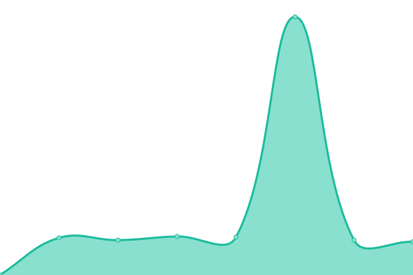
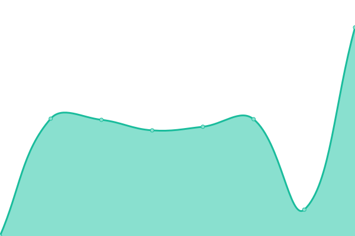

# [📈 Live Status](https://advancedcsg-open.github.io/status-myworkplace): <!--live status--> **🟩 All systems operational**

This repository contains the open-source uptime monitor and status page for [Advanced (open source)](https://oneadvanced.com), powered by [Upptime](https://github.com/upptime/upptime).

With [Upptime](https://upptime.js.org), you can get your own unlimited and free uptime monitor and status page, powered entirely by a GitHub repository. We use [Issues](https://github.com/advancedcsg-open/status-myworkplace/issues) as incident reports, [Actions](https://github.com/advancedcsg-open/status-myworkplace/actions) as uptime monitors, and [Pages](https://advancedcsg-open.github.io/status-myworkplace) for the status page.

<!--start: status pages-->
<!-- This summary is generated by Upptime (https://github.com/upptime/upptime) -->
<!-- Do not edit this manually, your changes will be overwritten -->
<!-- prettier-ignore -->
| URL | Status | History | Response Time | Uptime |
| --- | ------ | ------- | ------------- | ------ |
|  MyWorkplace | 🟩 Up | [my-workplace.yml](https://github.com/advancedcsg-open/status-myworkplace/commits/HEAD/history/my-workplace.yml) | 

 493ms
     
 | 

<a href="https://advancedcsg-open.github.io/status-myworkplace/history/my-workplace">100.00%</a>
    

|  [Organisation Discovery](https://dev.auth.identity.oneadvanced.io/auth/discover?redirectUri=https%3A%2F%2Fmyworkplace.oneadvanced.io%2Fparseauth%3FredirectUri%3Dhttps%253A%252F%252Fmyworkplace.oneadvanced.io%252F) | 🟩 Up | [organisation-discovery.yml](https://github.com/advancedcsg-open/status-myworkplace/commits/HEAD/history/organisation-discovery.yml) | 

 690ms
     
 | 

<a href="https://advancedcsg-open.github.io/status-myworkplace/history/organisation-discovery">100.00%</a>
    

<!--end: status pages-->

[**Visit our status website →**](https://advancedcsg-open.github.io/status-myworkplace)

## 📄 License

- Powered by: [Upptime](https://github.com/upptime/upptime)
- Code: [MIT](./LICENSE) © [Advanced (open source)](https://oneadvanced.com)
- Data in the `./history` directory: [Open Database License](https://opendatacommons.org/licenses/odbl/1-0/)
